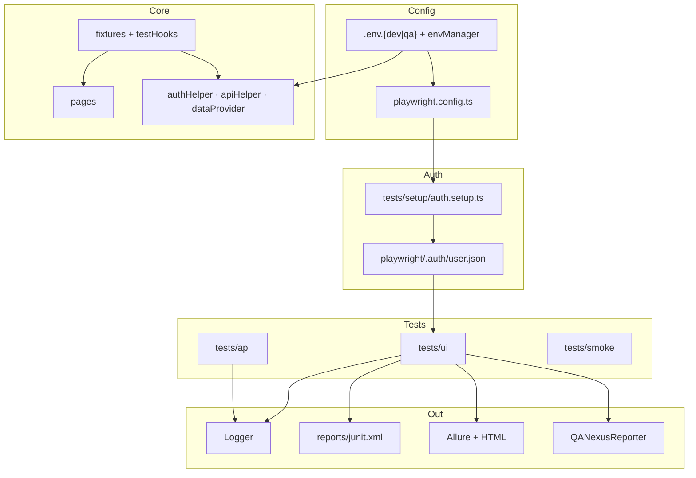

# QANexus

**Because clicking buttons manually is a personality trait, not a testing strategy.**


> Friends don't let friends run regression suites manually.  
> If your test suite takes longer than a Marvel movie, we need to talk.

**QANexus** is a Playwright + TypeScript framework aimed at the [OrangeHRM open-source demo](https://opensource-demo.orangehrmlive.com/). It’s built the way teams actually ship automation: login once, tag everything, yell at CI when it breaks, and keep the receipts in three report formats.

This is not a “hello world” repo with a `tests/example.spec.ts` and dreams. It has auth storage, data-driven login, API specs, a custom reporter, and two CI pipelines so PRs don’t wait on WebKit while you’re still arguing about variable names.

---

## Table of Contents

- [Quick Start](#quick-start)
- [What’s in the Box](#whats-in-the-box)
- [Architecture](#architecture)
- [Folder Structure](#folder-structure)
- [Configuration (Single Source of Truth)](#configuration-single-source-of-truth)
- [Authentication State Management](#authentication-state-management)
- [Data-Driven Testing](#data-driven-testing)
- [API Tests](#api-tests)
- [Logging](#logging)
- [Test Tags](#test-tags)
- [Reporting (HTML, JUnit, Allure, QANexus)](#reporting-html-junit-allure-qanexus)
- [CI Strategy](#ci-strategy)
- [Execution Commands](#execution-commands)
- [Known Reality Check](#known-reality-check)
- [License](#license)

---

## Quick Start

```bash
git clone https://github.com/your-org/QANexus.git
cd QANexus
cp .env.dev.example .env.dev
npm install
npx playwright install chromium   # enough for local smoke runs
npx playwright test --grep @smoke --project=setup --project=smoke --project=chromium --project=chromium-login --project=api
```

If that passes, you’ve automated more than most “we’ll add tests in the next sprint” tickets. Celebrate responsibly.

---

## What’s in the Box

| Area | What you get |
|------|----------------|
| **UI** | Page objects, custom fixtures, `storageState` auth |
| **API** | `ApiClient`, `AuthApi`, `UserApi`, `apiHelper`, `tests/api/*.api.spec.ts` |
| **Data** | `loginData.json` + `dataProvider.ts` (CSV hook ready) |
| **Config** | `envManager` → `appConfig` drives Playwright timeouts, retries, workers, headless |
| **Observability** | `Logger` → console + `logs/framework.log` |
| **Reports** | HTML, JUnit XML, Allure, `QANexusReporter` summary |
| **CI** | PR = Chromium + `@smoke` · Nightly = full suite + all browsers |

---

## Architecture



**In one sentence:** env loads once → setup logs in and saves cookies → authenticated UI tests skip the login screen → API tests hit the same config → four reporters argue about who gets to tell you it failed.

---

## Folder Structure

```
QANexus/
├── .github/workflows/
│   ├── playwright-pr.yml       # PR: @smoke, Chromium only
│   └── playwright-nightly.yml  # 02:00 UTC: full suite, all browsers
├── playwright/.auth/           # user.json (gitignored)
├── logs/framework.log          # gitignored
├── reports/                    # html-report, junit.xml, test-results
├── src/
│   ├── api/                    # ApiClient, AuthApi, UserApi
│   ├── config/                 # envManager (SSOT)
│   ├── constants/              # routes, messages, testTags
│   ├── data/                   # loginData.json, users.json
│   ├── fixtures/               # loginPage, authenticatedDashboard, …
│   ├── helpers/                # authHelper, apiHelper, dataProvider
│   ├── hooks/                  # testHooks (auto lifecycle logs)
│   ├── pages/
│   ├── reporters/              # QANexusReporter.ts
│   ├── types/
│   └── utils/                  # logger, fileUtils, dateUtils
└── tests/
    ├── setup/auth.setup.ts
    ├── smoke/config.spec.ts
    ├── ui/login.spec.ts, dashboard.spec.ts
    └── api/auth.api.spec.ts, user.api.spec.ts, health.api.spec.ts
```

---

## Configuration (Single Source of Truth)

`playwright.config.ts` does **not** make up its own timeouts anymore. It reads **`appConfig`** from `envManager`, which loads `.env.{TEST_ENV}`:

| `.env` key | Drives |
|------------|--------|
| `TEST_TIMEOUT_MS` | Playwright test timeout |
| `EXPECT_TIMEOUT_MS` | `expect()` timeout |
| `RETRIES` | Retries (local vs QA file) |
| `WORKERS` | Parallelism (`4` or `50%`) |
| `HEADLESS` | Browser headless flag |
| `BASE_URL` / `API_BASE_URL` | UI and API targets |
| `USERNAME` / `PASSWORD` | Credentials (never hard-coded in specs for valid user) |

Copy `.env.dev.example` → `.env.dev` locally. CI copies `.env.qa.example` → `.env.qa`.

Change a value in the env file, re-run tests. No config archaeology required.

---

## Authentication State Management

Logging in before every test is like explaining Jira tickets to someone who wasn’t in the meeting. You can do it. You shouldn’t have to.

### How it works

1. **`setup` project** runs `tests/setup/auth.setup.ts` (tagged `@smoke` `@critical` so PR pipelines include it).
2. `loginViaUi()` signs in with credentials from `.env`.
3. Session is written to **`playwright/.auth/user.json`**.
4. **`chromium` / `firefox` / `webkit`** depend on `setup` and load `storageState`.
5. **`chromium-login`** runs login specs **without** saved cookies — negative tests stay honest.
6. **`authenticatedDashboard`** fixture opens the dashboard directly. No login déjà vu.

```bash
npx playwright test --project=setup
npx playwright test tests/ui/dashboard.spec.ts --project=chromium
```

**PR pipeline** only installs Chromium. **Nightly** runs setup once per browser family that needs it. Same pattern, different scale.

---

## Data-Driven Testing

Login scenarios live in **`src/data/loginData.json`** as an array:

| `id` | What it proves |
|------|----------------|
| `validUser` | Happy path — username/password merged from `.env` at runtime |
| `invalidUser` | Bad creds → stays on login + error message |
| `emptyCredentials` | Validation → required field messaging |

**`src/helpers/dataProvider.ts`** loads JSON today. Flip `LOGIN_DATA_FORMAT` to `'csv'` when QA inevitably sends a spreadsheet.

`tests/ui/login.spec.ts` loops cases instead of copy-pasting three tests that only differ by password:

```typescript
const loginData = getLoginTestCases();

for (const user of loginData) {
  test(`[${user.id}] ${user.description}`, { tag: tagsForLoginCase(user) }, async ({ loginPage }) => {
    await openLoginPage(loginPage);
    await loginPage.login(user.username, user.password);
    await assertLoginOutcome(loginPage, user);
  });
}
```

New scenario? Edit JSON. The spec file stays closed. Future you owes present you a coffee.

---

## API Tests

The API layer isn’t decoration — there are real specs under **`tests/api/`**:

| Spec | Covers |
|------|--------|
| `health.api.spec.ts` | Web `BASE_URL` up; API base not returning 5xx |
| `auth.api.spec.ts` | Valid login, invalid login (`ApiError`), session validate |
| `user.api.spec.ts` | `getUsers()`, `getUserById()` after `loginViaApi` |

They use Playwright’s **`request`** fixture via the dedicated **`api`** project (`baseURL` = `API_BASE_URL`), plus your existing stack:

- `AuthApi` / `UserApi` / `ApiClient`
- `apiHelper.createAuthApi()`, `loginViaApi(request)`, `createUserApi()`
- `@api` tags and `Logger` on the way in and out

```bash
npx playwright test --project=api
npm run test:api -- --project=api
npx playwright test --grep @api
```

**Honest note:** OrangeHRM’s public demo API sometimes returns 404 or omits tokens. Tests `skip` when there’s no token instead of failing with a mystery. That’s the framework telling the truth about the environment, not flaking into gaslighting.

---

## Logging

**`src/utils/logger.ts`** — singleton `Logger` with `debug` | `info` | `warn` | `error`.

```
[2026-06-03 14:03:59] [INFO] User logged in via UI {"username":"Admin"}
```

- **Console:** colored when your terminal supports it (unlike production at 3 a.m.).
- **File:** `logs/framework.log` — plain text, parallel-safe enough for a portfolio, audit-friendly for real teams.

Set `LOG_LEVEL=debug` when you need to know which locator waited 30 seconds and why.

Wired into: `BasePage`, fixtures, `ApiClient`, `authHelper`, `apiHelper`, `auth.setup.ts`, and `testHooks` (test start/finish — failures log at `error`).

---

## Test Tags

Defined in **`src/constants/testTags.ts`**. Used in metadata **and** titles via `taggedTitle()` / `taggedDescribe()` so HTML reports don’t look like encrypted filenames.

| Tag | Typical use |
|-----|-------------|
| `@smoke` | PR gate — “did we break the universe?” |
| `@sanity` | Core paths still breathe |
| `@regression` | Negative / edge cases |
| `@critical` | Release blockers |
| `@ui` | Browser specs |
| `@api` | API project specs |

```bash
npx playwright test --grep @smoke
npx playwright test --grep @regression
npx playwright test --grep "@smoke" --grep "@ui"
npx playwright test --grep-invert @regression
```

CI uses these tags for real. This isn’t documentation fiction.

---

## Reporting (HTML, JUnit, Allure, QANexus)

`playwright.config.ts` registers **four** reporters. Yes, four. We like evidence.

| Reporter | Output | Who cares |
|----------|--------|-----------|
| **list** | Terminal stream | You, during `npm test` |
| **QANexusReporter** | Console summary | Humans who want closure |
| **html** | `reports/html-report` | Debugging failures with traces/screenshots |
| **allure-playwright** | `allure-results` → generate to `reports/allure-report` | Managers who love charts |
| **junit** | `reports/junit.xml` | CI platforms |

### QANexusReporter

```
=================================
QANexus Execution Summary
=================================

Passed: 8
Failed: 1
Skipped: 2
Pass rate: 72.7%
Duration: 4m 12s

=================================
```

Counts final outcomes only (retries aren’t double-counted). Pass rate included because “it mostly worked” should be a number, not a vibe.

### JUnit XML

Enterprise CI speaks JUnit. Jenkins, GitLab, and Azure DevOps ingest `reports/junit.xml` for pass/fail gates and trend lines — without custom parsers held together with hope.

CI uploads JUnit as an artifact on both PR and nightly workflows.

### Allure

After the run:

```bash
npx allure-commandline generate allure-results --clean -o reports/allure-report
```

GitHub Actions does this automatically (`if: always()` — because failures are exactly when you need the report).

Open locally when you want history, categories, and the illusion of control.

### HTML

```bash
npm run test:report
```

Opens `reports/html-report`. Click failed tests. Regret clicking. Fix test. Classic loop.

---

## CI Strategy

We split pipelines so PRs don’t wait for three browsers to agree the demo app is having a day.

### PR — `playwright-pr.yml`

**When:** `pull_request` → `main`, `develop`  
**What:** `@smoke` only · **Chromium only**  
**Why:** Fast feedback (~minutes, not a lunch break)

```yaml
npx playwright install chromium --with-deps
npx playwright test --grep @smoke \
  --project=setup --project=smoke --project=chromium \
  --project=chromium-login --project=api
```

| Benefit | |
|---------|--|
| Blocks bad merges | Core paths + config + API smoke |
| Cheap | One browser install |
| Cancels stale runs | New push kills old PR job |

Artifacts: HTML, JUnit, Allure, traces (7-day retention).

### Nightly — `playwright-nightly.yml`

**When:** `0 2 * * *` UTC + manual `workflow_dispatch`  
**What:** **`npm test`** — all projects, **Chromium + Firefox + WebKit**  
**Why:** Cross-browser pain belongs on a schedule, not every push

| Benefit | |
|---------|--|
| Full coverage | Login regression, dashboard, API depth |
| Cross-browser | Engine-specific bugs surface here |
| Doesn’t block PRs | Investigate in the morning with coffee |

Artifacts: 14-day retention. Same report types.

### Strategy at a glance

| | PR | Nightly |
|--|-----|---------|
| Trigger | Pull request | Cron / manual |
| Browsers | Chromium | Chromium, Firefox, WebKit |
| Filter | `@smoke` | Full suite |
| Install | `playwright install chromium` | `playwright install --with-deps` |
| Merge gate | Yes | Signal only |

**Simulate locally:**

```bash
# PR
npx playwright test --grep @smoke --project=setup --project=smoke --project=chromium --project=chromium-login --project=api

# Nightly
npm test
```

---

## Execution Commands

### Setup

```bash
cp .env.dev.example .env.dev
npm install
npx playwright install          # all browsers
npx playwright install chromium # PR-like lean install
```

### Common runs

```bash
npm test                        # everything (nightly equivalent)
npm run test:ui                   # tests/ui
npm run test:api -- --project=api
npm run typecheck
npm run test:report               # HTML report
npm run clean                     # reports + allure-results
```

### By tag / project

```bash
npx playwright test --grep @smoke
npx playwright test --grep @critical
npx playwright test --grep @regression
npx playwright test --project=chromium-login
npx playwright test --project=setup
```

### Headed / debug (when you need to watch it fail live)

```bash
npm run test:headed
npm run test:debug
```

---

## Known Reality Check

The OrangeHRM **public demo** is not your staging environment. It has:

- Intermittent **500** responses (we’ve met the nginx error page personally)
- API paths that may **404** depending on demo version
- No SLA, no ticket queue, no on-call

QANexus handles that like adults: health checks, skips when tokens are missing, retries from `.env`. A red build might mean “fix the test” or “the demo is having an existential crisis.” Read the logs. `logs/framework.log` doesn’t lie.

---

## License

MIT — fork it, show recruiters, extend it. If the demo is down, that’s not your framework’s fault. That’s free infrastructure reminding you why you automate in the first place.

---

<p align="center">
  <strong>QANexus</strong> — automate the boring stuff. Save manual testing for the weird edge cases and the production incidents that build character.
</p>
