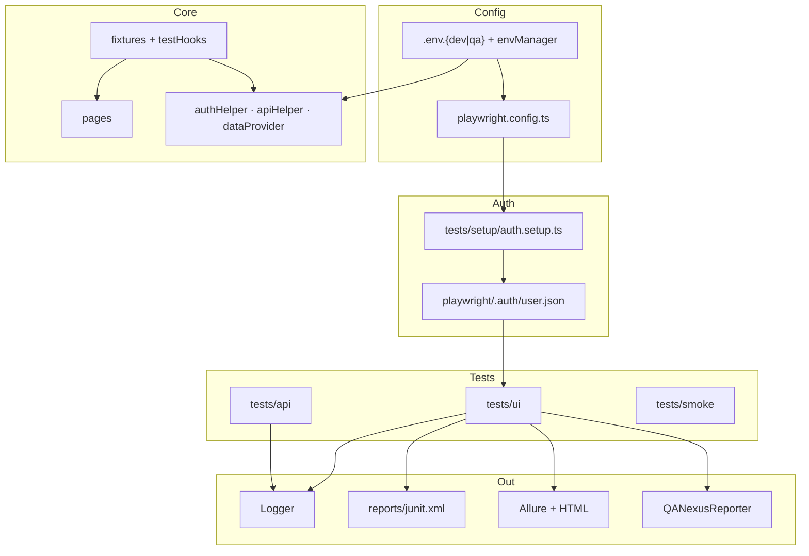

# QANexus

**Because clicking buttons manually is a personality trait, not a testing strategy.**


> Friends don't let friends run regression suites manually.  
> If your test suite takes longer than a Marvel movie, we need to talk.

**QANexus** is a Playwright + TypeScript framework designed for the [OrangeHRM open-source demo](https://opensource-demo.orangehrmlive.com/). It is built the way modern engineering teams actually scale test automation: login once, validate environments, leverage API utilities, run tests in parallel, tag appropriately, and keep the receipts in multiple report formats.

This is not a template with a default search test. It is a fully decoupled, type-safe automated framework with project-level authentication state caching, robust API mocks/clients, data-driven runners, a custom reporter, and dual-track CI pipelines.

---

## Table of Contents

- [Quick Start](#quick-start)
- [Framework Features](#framework-features)
- [Architecture](#architecture)
- [Folder Structure](#folder-structure)
- [Environment Management](#environment-management)
- [Authentication State Management](#authentication-state-management)
- [Page Object Model (POM)](#page-object-model-pom)
- [API Layer](#api-layer)
- [Data-Driven Testing](#data-driven-testing)
- [Logger](#logger)
- [Test Tags](#test-tags)
- [Reporting (HTML, JUnit, Allure, QANexus)](#reporting-html-junit-allure-qanexus)
- [CI/CD Pipelines](#cicd-pipelines)
- [Execution Commands](#execution-commands)
- [Screenshots](#screenshots)
- [Known Reality Check](#known-reality-check)
- [License](#license)

---

## Quick Start

```bash
# Clone the repository
git clone https://github.com/Kalrav13/QANexus.git
cd QANexus

# Setup environment properties
cp .env.qa.example .env.qa

# Install dependencies and Playwright browsers
npm install
npx playwright install chromium

# Run the smoke tests (combines UI, API, and Config checks)
npx playwright test --grep @smoke --project=setup --project=smoke --project=chromium --project=chromium-login --project=api
```

If that passes, you’ve automated more than most "we'll write tests in the next sprint" tickets. Celebrate responsibly.

---

## Framework Features

| Feature | Implementation | Purpose |
|------|----------------|---------|
| **UI Automation** | TypeScript Page Objects, custom fixtures, cached `storageState` session | Fast UI tests that skip the login screen |
| **API testing** | `ApiClient` request wrapper, typed domains (`UserApi`, `AuthApi`) | Isolation of REST validation from browser flows |
| **Environment Control**| Class-based `EnvManager` validating strict schema options | Single source of truth (SSOT) config mapping |
| **Logging** | Context-safe Singleton console + file logger (`logs/framework.log`) | High observability on test lifecycle steps |
| **Data-Driven Runs** | `dataProvider` interface resolving JSON scenarios | Scaling tests via schema files without code edits |
| **Multi-Reporting** | HTML, JUnit XML, Allure, plus custom console summaries | Automated test reporting for devs and managers |
| **CI/CD** | GitHub Actions (PR & Nightly workflows) | Fail-fast validation gates on every commit |

---

## Architecture



**In short:** Configuration loads once → setup logs in and writes storage state → UI specs load state and jump straight to the dashboard → API tests execute endpoint validation in parallel → reporters package up logs and screenshots.

---

## Folder Structure

```
QANexus/
├── .github/workflows/
│   ├── playwright-pr.yml       # PR checks: @smoke, Chromium only
│   └── playwright-nightly.yml  # Scheduled: full suite on all browsers
├── playwright/
│   └── .auth/                  # user.json (cached storage state)
├── logs/
│   └── framework.log           # plain text run execution logs
├── reports/                    # html-report, junit.xml, test-results
├── src/
│   ├── api/                    # ApiClient, AuthApi, UserApi
│   ├── config/                 # envManager (Environment config loader)
│   ├── constants/              # routes, messages, testTags
│   ├── data/                   # JSON schemas for data-driven testing
│   ├── fixtures/               # loginPage, authenticatedDashboard, etc.
│   ├── helpers/                # authHelper, apiHelper, dataProvider
│   ├── hooks/                  # testHooks (context-safe lifecycle logging)
│   ├── pages/                  # POM classes (BasePage, LoginPage, DashboardPage)
│   ├── reporters/              # QANexusReporter.ts (console summary)
│   ├── types/                  # API, UI, and Environment typings
│   └── utils/                  # logger, fileUtils, dateUtils
└── tests/
    ├── setup/auth.setup.ts     # UI session state generator
    ├── smoke/config.spec.ts    # framework bootstrapping check
    ├── ui/                     # UI verification spec files
    └── api/                    # API integration spec files
```

---

## Environment Management

Rather than spreading timeouts and hardcoded URLs across the codebase, configuration is handled as a single source of truth (SSOT) via `src/config/envManager.ts`.

* The `EnvManager` class reads `.env.${TEST_ENV}` depending on the active context.
* It parses variables into strict TypeScript types (e.g. timeout values as numbers, headless flags as booleans) and performs strict validation.
* Missing configurations or incorrect types throw explicit errors immediately upon initialization, preventing tests from running in a half-configured state.

Example variables used to drive tests:
* `TEST_TIMEOUT_MS` / `EXPECT_TIMEOUT_MS`: Time limits for tests and assertion checkpoints.
* `RETRIES` / `WORKERS`: Configure test worker counts and execution retries.
* `BASE_URL` / `API_BASE_URL`: Destination URLs for UI and REST testing.

---

## Authentication State Management

Logging in before every UI test is like explaining a Jira ticket to someone who was in the refinement meeting: you can do it, but you really shouldn't have to.

QANexus solves this using project-level caching:
1. **The `setup` project** runs `tests/setup/auth.setup.ts`. It launches the browser, triggers UI-based login, and captures the cookies and sessionStorage.
2. The authenticated state is written directly to `playwright/.auth/user.json`.
3. Standard test projects (`chromium`, `firefox`, `webkit`) load this file as their `storageState`.
4. The `authenticatedDashboard` fixture routes to the landing screen with cookies pre-loaded, saving seconds on every single test run.
5. The `chromium-login` project remains uncached to run negative credential validations.

---

## Page Object Model (POM)

UI interaction elements are grouped under `src/pages` to decouple selectors from spec assertions:
* **`BasePage.ts`**: Implements custom action helpers (`clickElement`, `fillText`, `getText`, `isVisible`) and handles screenshot generation.
* **`LoginPage.ts`**: Exposes form field locators (`input[name="username"]`) and contains execution routines for credentials.
* **`DashboardPage.ts`**: Declares panel locators and elements to confirm user session boundaries.

---

## API Layer

API validation operates independently of the browser lifecycle:
* **`ApiClient`**: A wrapper for Playwright's `APIRequestContext` that intercepts request lifecycles, parses JSON responses, handles HTTP headers, and throws clean `ApiError` instances on non-2xx statuses.
* **Domain Modules**: Subclasses `AuthApi` and `UserApi` encapsulate URL route endpoints and payload formats.
* **Persona Mocking**: The `apiHelper` resolves user data personas (like `admin` or `essUser` configurations) to validate API permissions and query data limits.

---

## Data-Driven Testing

Scenarios are separated from test files and stored under `src/data/loginData.json`. This decouples scenario logic from execution syntax.

* **`dataProvider.ts`**: Loads, resolves, and maps data records to typed test cases.
* **Credential Injection**: Valid credentials for sandbox environments are dynamically fetched from the environment manager at runtime to keep secrets out of data files.
* **Extendable**: The helper parses JSON files and includes code hooks to import CSV structures seamlessly.

---

## Logger

Logs are handled by a singleton `LoggerService` exposed in `src/utils/logger.ts`. It provides context-safe logging across the framework:
* **Console Output**: Supports colored logs based on severity levels (`debug`, `info`, `warn`, `error`).
* **File Output**: Writes logs to `logs/framework.log` to track step executions.
* **Lifecycle Hooks**: Integrated into `src/hooks/testHooks.ts` to automatically record test start/finish actions and capture context values (like worker index or run duration). It guarantees `this` context preservation when invoked inside test lifecycles.

---

## Test Tags

Test tags are defined as constants inside `src/constants/testTags.ts` to allow easy suite filtering:
* `@smoke`: Quick checks to verify core project capabilities.
* `@sanity`: Verifies primary user journeys.
* `@regression`: Extensive scenarios validating edge cases.
* `@critical`: Blocks deployment on failure.
* `@ui` / `@api`: Isolates test categories.

Tags are passed directly to Playwright's native `tag` metadata property to facilitate execution filters:
```bash
# Run only smoke checks
npx playwright test --grep @smoke

# Run UI tests, excluding regression edge-cases
npx playwright test --grep @ui --grep-invert @regression
```

---

## Reporting (HTML, JUnit, Allure, QANexus)

The framework generates four reports to satisfy different engineering audiences:
1. **HTML Reporter**: Ideal for local debugging. Provides visual traces, screenshots, and step-by-step videos on failures.
2. **JUnit XML Reporter**: Outputs `reports/junit.xml` to allow standard CI runners (like GitLab or Jenkins) to parse test pass/fail results.
3. **Allure Reporter**: Compiles runs into interactive charts showing test histories, failures, and execution timings.
4. **QANexus Reporter**: A custom console reporter that summarizes runs (retries are resolved to output single execution stats):
   ```
   =================================
   QANexus Execution Summary
   =================================
   
   Passed: 8
   Failed: 1
   Skipped: 2
   Pass rate: 72.7%
   Duration: 4m 12s
   
   =================================
   ```

---

## CI/CD Pipelines

GitHub Actions workflows are structured into two jobs:

### PR Validation Pipeline (`playwright-pr.yml`)
* **Trigger**: Triggers on pull requests targeting `main` and `develop`.
* **Scope**: Focuses exclusively on `@smoke` tests running on **Chromium** to keep feedback loops fast.
* **Features**: Uses run concurrency to cancel stale runner builds on subsequent pushes.

### Nightly Regression Pipeline (`playwright-nightly.yml`)
* **Trigger**: Scheduled cron job executing daily at 02:00 UTC.
* **Scope**: Runs the entire test suite on all supported browser projects (**Chromium, Firefox, and WebKit**).
* **Features**: Uploads trace files, JUnit records, and Allure outputs.

---

## Execution Commands

### Local Installation
```bash
npm install
npx playwright install
```

### Running Tests
```bash
# Execute the entire suite
npm test

# Run UI tests only
npm run test:ui

# Run API tests only
npm run test:api

# Launch tests in headed mode or debug inspector
npm run test:headed
npm run test:debug
```

### Static Checks & Report Generation
```bash
# Run ESLint parser
npm run lint

# Run TypeScript compilation checks
npm run typecheck

# Open Playwright HTML Report
npm run test:report

# Clear report directories
npm run clean
```

---

## Screenshots

Below are placeholders for the visual execution reports generated by this framework:

### GitHub Actions Pipeline
*Placeholder for GitHub Actions PR workflow logs and test suite runs.*


### Allure Report Dashboard
*Placeholder for the interactive Allure charts and historical dashboards.*


### Playwright HTML Report
*Placeholder for the default Playwright HTML Trace Viewer representation.*


### QANexus Custom Reporter Output
*Placeholder showing the QANexus custom reporter summary in the terminal.*


---

## Known Reality Check

The target of this framework is a public sandbox app (`opensource-demo.orangehrmlive.com`). This environment does not come with an SLA and frequently suffers from database load issues, nginx timeouts, and rate limits.

QANexus is designed to handle this reality:
* Network request checks verify site availability before UI suites spin up.
* API test specs automatically skip their blocks if the server fails to return tokens, preventing server flakiness from polluting code execution statistics.

---

## License

This project is licensed under the MIT License. Feel free to clone, customize, or use it to show recruiters how production automation pipelines are built.
