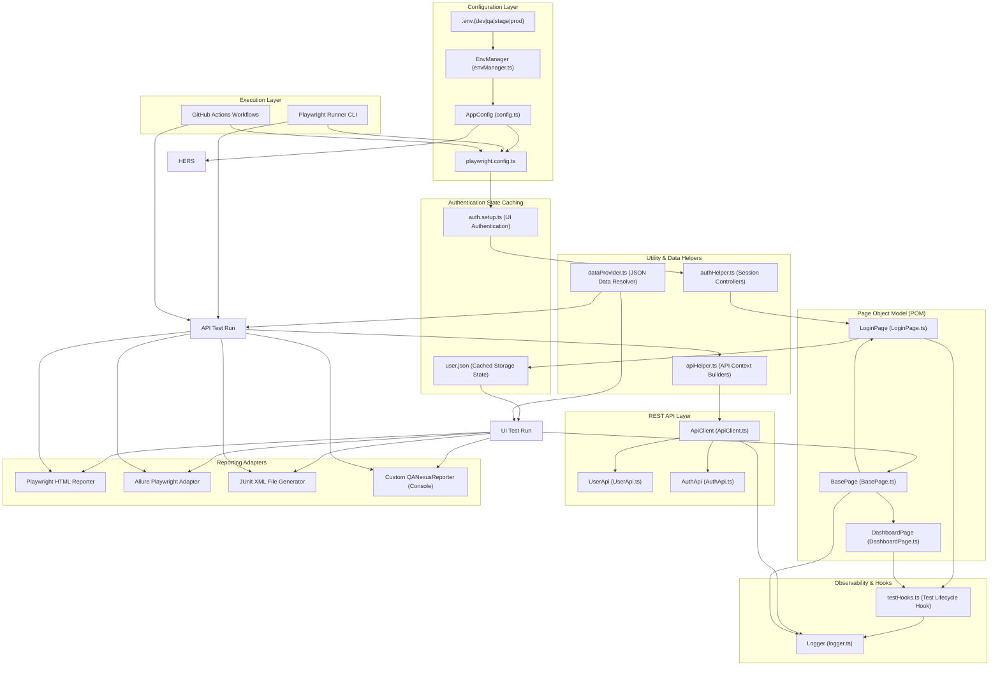
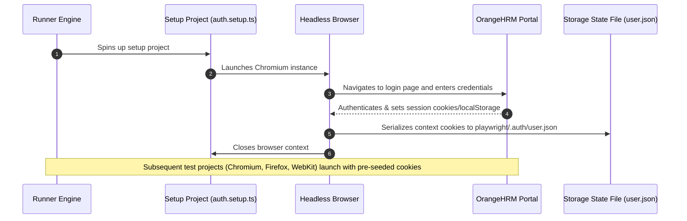

# QANexus: Architecture & Technical Overview

Welcome to the technical design document for **QANexus**, an enterprise-grade automated testing framework built on **Playwright** and **TypeScript** targeted at the OrangeHRM platform. This document outlines the architectural layers, system flows, design patterns, and deployment configurations of the framework.

---

## 1. System Architecture Layout

QANexus is designed using a decoupled, layered architecture. This separates configuration resolution, browser orchestration, page object structures, test data, and reporting adapters into distinct boundaries.



---

## 2. Structural Layer Analysis

### A. Configuration & Environment Management
QANexus avoids hardcoded execution properties by centralizing environment details inside `src/config/`.

* **`envManager.ts`**: Implements a class-based `EnvManager` loaded via `dotenv`. It reads `process.env.TEST_ENV` (falling back to `NODE_ENV` or `dev`) to select the appropriate `.env.[env]` file.
* **Schema Validation**: The manager loops through `REQUIRED_KEYS` to verify that essential variables (e.g. `BASE_URL`, `API_BASE_URL`, `TEST_TIMEOUT_MS`) are populated. It validates property types (casting timeout ms to numbers, headless flags to booleans) and throws explanatory errors upon initialization if configurations are invalid.
* **`playwright.config.ts`**: Consumes `appConfig` as its Single Source of Truth (SSOT) to configure retries, workers, timeouts, and project browser viewports.

---

### B. Authentication State Management
Logging in before every single UI browser test is a major performance bottleneck. QANexus utilizes Playwright's `storageState` dependency engine to authenticate once per run:



---

### C. Page Object Model (POM) Abstraction
The POM layer isolates browser manipulation from test file assertions under `src/pages/`:

* **`BasePage.ts`**: The base class for all pages. It encapsulates locator fetching, wait conditions, and action commands (`clickElement`, `fillText`, `getText`, `isVisible`). This ensures tests use a unified interaction mechanism.
* **`LoginPage.ts`**: Houses locators for username/password fields and encapsulates validation logic for happy and error-path credential entries.
* **`DashboardPage.ts`**: Declares panel navigation components and handles profile menus, logs, and application sign-out controls.

---

## 3. REST API Testing Layer
The API layer executes standalone contract validation and supports data provisioning operations under `src/api/`:

* **`ApiClient`**: Wraps Playwright's `APIRequestContext` to orchestrate headers (e.g. Authorization tokens) and parse response content types. It intercepts non-2xx status returns, logging details and throwing structured `ApiError` instances.
* **Domain Clients (`AuthApi`, `UserApi`)**: Subclasses map URL endpoints and define typed payload requests/responses to ensure type safety inside API test specs.

---

## 4. Data-Driven Testing Architecture
QANexus cleanly separates variables from test files to make scaling test coverage a matter of data configuration:

* **Mock Schemas**: Test parameters are stored under `src/data/loginData.json` using unique ids (e.g., `validUser`, `invalidUser`).
* **Environment Merge**: The helper `dataProvider.ts` parses this file. For tests containing sensitive credentials (such as the happy-path `validUser`), the provider dynamically fetches passwords from `appConfig.credentials` at runtime, keeping secrets out of data files.
* **CSV Hook**: Minimally implements `loadCsvData` utilizing standard file reads so teams can easily switch formats if test parameters are provided as spreadsheets.

---

## 5. Observability (Logging & Hooks)
To provide trace logs when a test fails, the framework implements a singleton Logger service in `src/utils/logger.ts` alongside custom lifecycle hooks:

* **LoggerService**: Writes logs in real-time to stdout and appending synchronous logs to `logs/framework.log`. Supports logging priorities (`debug`, `info`, `warn`, `error`).
* **`testHooks.ts` (`withTestHooks`)**: Registers an auto-running test fixture wrapper. It logs the start execution values (test title, project name, timestamp) and automatically routes end outcomes (including test duration) to either `info` or `error` depending on the test status. Context binding is preserved via direct method calls on the `Logger` instance.

---

## 6. Custom Reporter
The custom reporter `src/reporters/QANexusReporter.ts` hooks into Playwright's `Reporter` interface to print execution metrics:

* **Outcomes Aggregator**: Evaluates final test results (resolving retried test results so only the final pass/fail status is counted).
* **Console Summary**: Outputs statistics on console close:
  ```
  =================================
  QANexus Execution Summary
  =================================
  
  Passed: 8
  Failed: 1
  Skipped: 2
  Pass rate: 72.7%
  Duration: 4m 12s
  
  =================================
  ```

---

## 7. CI/CD Pipeline Lifecycles

GitHub Actions workflows are split to separate fast code integration checks from nightly regression validations:

```mermaid
gantt
    title CI/CD Run Strategy Comparison
    dateFormat X
    axisFormat %s

    section Pull Request (playwright-pr.yml)
    Spin up Runner         :active, pr1, 0, 10
    Install Node & Chromium :active, pr2, 10, 30
    Run Smoke Tests (Chromium Only) :active, pr3, 30, 80
    Upload HTML/JUnit/Allure Reports :active, pr4, 80, 100

    section Nightly Regression (playwright-nightly.yml)
    Spin up Runner         :crit, n1, 0, 10
    Install Node & All Browsers :crit, n2, 10, 50
    Run Full Suite (Cross-Browser Matrix) :crit, n3, 50, 200
    Compile & Upload Allure & Test Results :crit, n4, 200, 240
```



1. **Pull Request (Smoke Gate)**:
   * **Trigger**: Triggered on push to `main`/`develop` or pull request.
   * **Scope**: Restricts execution to tests tagged `@smoke` and targets **Chromium** only, keeping verification times under a few minutes.
2. **Nightly Regression (Matrix Gate)**:
   * **Trigger**: Automated cron schedule triggering daily at 02:00 UTC.
   * **Scope**: Executes all spec files across **Chromium, Firefox, and WebKit** projects in parallel.
